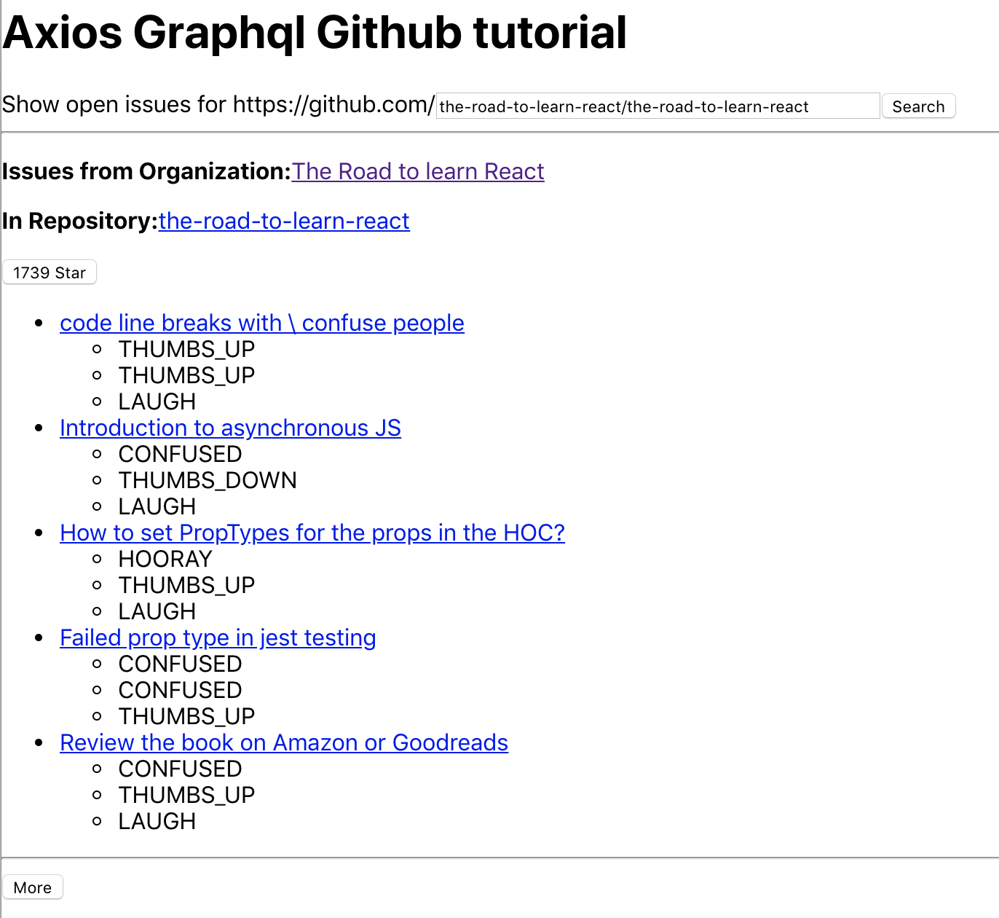

# :milky_way: axios-graphql-github-tutorial :milky_way:

## how to run it

```
git clone git@github.com:GBouffard/axios-graphql-github-tutorial.git
cd axios-graphql-github-tutorial
npm install
code .env
```

Replace `addYourTokenHere` with your [personal token from Github]. The scopes/permissions that need to be checked are: admin:org, repo, user, notifications.
See my random training on how to generate a Github Access token or [Github help](https://help.github.com/en/enterprise/2.17/user/articles/creating-a-personal-access-token-for-the-command-line)

```
npm start
```

- visit `http://localhost:3000`

## how it works:

- The Github Access token is sent within the Authorization headers. Ssee axiosGitHubGraphQL within helpers.js to see how.
- the graphQL queries are in `src/graphql-queries.js`.
- The methods triggering the queries and the variables being passed through Axios are defined within `/src/helper.js`.
- The `App` has a form that accepts a path to a Github repository. It has a default value. On input change, the GraphQL queries are triggered to get opened issuess. Changing the path to nodejs/node for example give different results. The App also has the Organization component.
- `Organization` renders a header and the Respository component.
- `Repository` renders the `StarButton`, each `IssueBulletPoint` including the 3 latest reactions as well as the `MoreIssuesButton` if there are some.
- nb: The App `useEffect` method needs a 2nd argument to not re-render at each update of the organization or errors internal states.

## Desktop preview:


